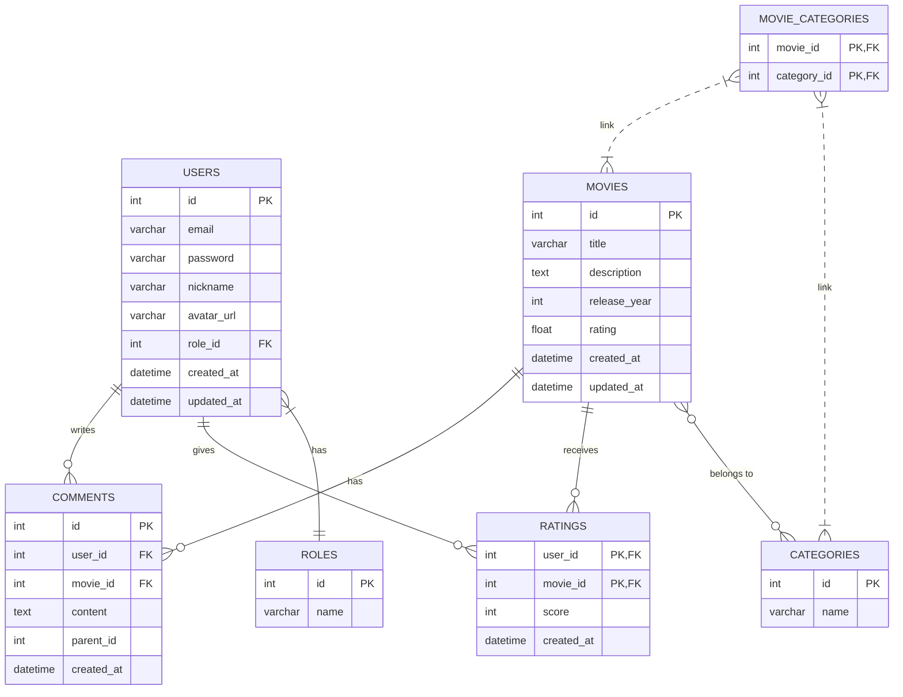

# 数据库设计

## 1. 概述

本数据库设计旨在为MovieInfo项目提供一个结构清晰、性能优越且易于扩展的数据存储方案。设计遵循第三范式（3NF），以减少数据冗余，保证数据一致性。

- **数据库类型**：MySQL 8.0
- **字符集**：`utf8mb4`，以支持包括Emoji在内的所有Unicode字符。
- **排序规则**：`utf8mb4_unicode_ci`，提供准确的排序和比较。

## 2. E-R图 (实体关系图)

## 3. 表结构设计

### 3.1 用户服务相关表

#### `users` - 用户表

| 字段名 | 类型 | 约束 | 描述 |
|---|---|---|---|
| `id` | `int` | `PK`, `AI` | 用户ID |
| `email` | `varchar(255)` | `UNIQUE`, `NOT NULL` | 登录邮箱 |
| `password` | `varchar(255)` | `NOT NULL` | 加密后的密码 |
| `nickname` | `varchar(50)` | `NULL` | 用户昵称 |
| `avatar_url` | `varchar(512)` | `NULL` | 头像URL |
| `role_id` | `int` | `FK(roles.id)` | 角色ID |
| `created_at` | `datetime` | | 创建时间 |
| `updated_at` | `datetime` | | 更新时间 |

#### `roles` - 角色表

| 字段名 | 类型 | 约束 | 描述 |
|---|---|---|---|
| `id` | `int` | `PK`, `AI` | 角色ID |
| `name` | `varchar(50)` | `UNIQUE`, `NOT NULL` | 角色名称 (e.g., 'user', 'admin') |

### 3.2 电影服务相关表

#### `movies` - 电影表

| 字段名 | 类型 | 约束 | 描述 |
|---|---|---|---|
| `id` | `int` | `PK`, `AI` | 电影ID |
| `title` | `varchar(255)` | `NOT NULL` | 电影标题 |
| `description` | `text` | `NULL` | 剧情简介 |
| `release_year` | `int` | `NULL` | 上映年份 |
| `rating` | `decimal(3,1)` | `DEFAULT 0.0` | 平均评分 |
| `poster_url` | `varchar(512)` | `NULL` | 海报图片URL |
| `created_at` | `datetime` | | 创建时间 |
| `updated_at` | `datetime` | | 更新时间 |

#### `categories` - 分类表

| 字段名 | 类型 | 约束 | 描述 |
|---|---|---|---|
| `id` | `int` | `PK`, `AI` | 分类ID |
| `name` | `varchar(50)` | `UNIQUE`, `NOT NULL` | 分类名称 (e.g., '剧情', '科幻') |

#### `movie_categories` - 电影与分类关联表 (多对多)

| 字段名 | 类型 | 约束 | 描述 |
|---|---|---|---|
| `movie_id` | `int` | `PK`, `FK(movies.id)` | 电影ID |
| `category_id` | `int` | `PK`, `FK(categories.id)` | 分类ID |

### 3.3 评论服务相关表

#### `comments` - 评论表

| 字段名 | 类型 | 约束 | 描述 |
|---|---|---|---|
| `id` | `int` | `PK`, `AI` | 评论ID |
| `user_id` | `int` | `FK(users.id)` | 发表评论的用户ID |
| `movie_id` | `int` | `FK(movies.id)` | 被评论的电影ID |
| `content` | `text` | `NOT NULL` | 评论内容 |
| `parent_id` | `int` | `NULL` | 回复的父评论ID，顶级评论为NULL |
| `created_at` | `datetime` | | 创建时间 |

#### `ratings` - 评分表

| 字段名 | 类型 | 约束 | 描述 |
|---|---|---|---|
| `user_id` | `int` | `PK`, `FK(users.id)` | 评分用户ID |
| `movie_id` | `int` | `PK`, `FK(movies.id)` | 被评分的电影ID |
| `score` | `tinyint` | `NOT NULL` | 评分 (1-10) |
| `created_at` | `datetime` | | 创建时间 |

## 4. 索引设计

为了优化查询性能，需要为常用查询字段创建索引。

- **`users`表**：
    - 在`email`字段上创建唯一索引，加速登录查询。
- **`movies`表**：
    - 在`title`字段上创建普通索引，加速按标题搜索。
    - 在`release_year`和`rating`上创建复合索引，优化筛选和排序。
- **`comments`表**：
    - 在`movie_id`和`created_at`上创建复合索引，加速查询某部电影下的评论并按时间排序。
- **`ratings`表**：
    - 主键(`user_id`, `movie_id`)本身就是复合索引，能高效查询用户对某电影的评分。

---
